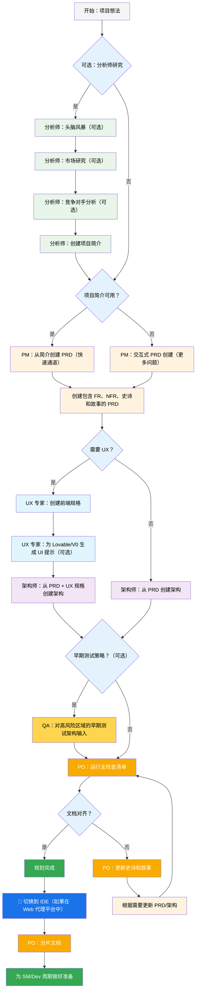
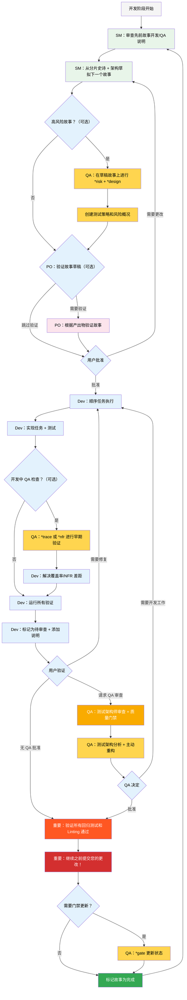

# BMad 方法 — 用户指南

本指南将帮助您理解并有效使用 BMad 方法进行敏捷 AI 驱动的规划和开发。

## BMad 规划和执行工作流

首先，这是完整的标准绿地规划 + 执行工作流。棕地（现有项目）非常相似，但建议首先了解这个绿地流程，即使是在简单项目上，然后再处理棕地项目。BMad 方法需要安装到新项目文件夹的根目录。对于规划阶段，您可以选择使用强大的 Web 代理执行，可能以更少的成本获得更高质量的结果，相比于在一些代理工具中提供您自己的 API 密钥或积分。对于规划，强大的思考模型和更大的上下文 - 以及作为代理的合作伙伴 - 将获得最佳结果。

如果您要将 BMad 方法与棕地项目（现有项目）一起使用，请查看 **[在棕地中工作](./working-in-the-brownfield.md)**。

如果下面的图表无法渲染，请安装 Markdown All in One 以及 Markdown Preview Mermaid Support 插件到 VSCode（或其中一个分叉克隆）。使用这些插件，如果您右键单击打开的标签页，应该有一个打开预览选项，或检查 IDE 文档。

### 规划工作流（Web UI 或强大的 IDE 代理）

在开发开始之前，BMad 遵循结构化的规划工作流，理想情况下在 Web UI 中完成以提高成本效益：



#### Web UI 到 IDE 转换

**关键转换点**：一旦 PO 确认文档对齐，您必须从 Web UI 切换到 IDE 开始开发工作流：

1. **复制文档到项目**：确保 `docs/prd.md` 和 `docs/architecture.md` 在您的项目文档文件夹中（或安装期间您可以指定的自定义位置）
2. **切换到 IDE**：在您首选的代理 IDE 中打开项目
3. **文档分片**：使用 PO 代理分片 PRD，然后分片架构
4. **开始开发**：开始遵循的核心开发周期

#### 规划产出物（标准路径）

```text
PRD              → docs/prd.md
架构             → docs/architecture.md
分片史诗          → docs/epics/
分片故事          → docs/stories/
QA 评估          → docs/qa/assessments/
QA 门禁          → docs/qa/gates/
```

### 核心开发周期（IDE）

规划完成并文档分片后，BMad 遵循结构化的开发工作流：



## 先决条件

安装 BMad 方法之前，请确保您有：

- **Node.js** ≥ 18，**npm** ≥ 9
- 已安装和配置 **Git**
- **（可选）** VS Code 与 "Markdown All in One" + "Markdown Preview Mermaid Support" 扩展

## 安装

### 可选

如果您想在 Web 上使用 Claude（Sonnet 4 或 Opus）、Gemini Gem（2.5 Pro）或自定义 GPT 进行规划：

1. 导航到 `dist/teams/`
2. 复制 `team-fullstack.txt`
3. 创建新的 Gemini Gem 或自定义 GPT
4. 上传文件并附上说明："您的关键操作说明已附加，按指示不要破坏角色"
5. 输入 `/help` 查看可用命令

### IDE 项目设置

```bash
# 交互式安装（推荐）
npx bmad-method install
```

## 特殊代理

有两个 BMad 代理 — 将来它们将合并为单个 BMad-Master。

### BMad-Master

此代理可以执行所有其他代理可以执行的任何任务或命令，除了实际的故事实现。此外，此代理可以通过访问知识库并向您解释流程的任何内容来帮助在 Web 上解释 BMad 方法。

如果您不想费心在不同代理之间切换（除了开发），这就是您的代理。请记住，随着上下文的增长，代理的性能会下降，因此重要的是指示代理压缩对话并以压缩对话作为初始消息开始新对话。经常这样做，最好在每个故事实现后。

### BMad-Orchestrator

此代理不应在 IDE 中使用，它是一个重量级的特殊用途代理，利用大量上下文并可以变形为任何其他代理。它的存在solely to facilitate the teams within the web bundles。如果您使用 Web 包，您将受到 BMad Orchestrator 的欢迎。

### 代理如何工作

#### 依赖系统

每个代理都有一个定义其依赖关系的 YAML 部分：

```yaml
dependencies:
  templates:
    - prd-template.md
    - user-story-template.md
  tasks:
    - create-doc.md
    - shard-doc.md
  data:
    - bmad-kb.md
```

**要点：**

- 代理仅加载其需要的资源（精简上下文）
- 依赖关系在打包期间自动解析
- 资源在代理之间共享以保持一致性

#### 代理交互

**在 IDE 中：**

```bash
# 某些 IDE，如 Cursor 或 Windsurf 例如，利用手动规则，因此交互使用'@'符号完成
@pm 为任务管理应用创建 PRD
@architect 设计系统架构
@dev 实现用户认证

# 某些 IDE，如 Claude Code，使用斜杠命令代替
/pm 创建用户故事
/dev 修复登录错误
```

#### 交互模式

- **增量模式**：与用户输入的逐步过程
- **YOLO 模式**：最少交互的快速生成

## IDE 集成

### IDE 最佳实践

- **上下文管理**：仅在上下文中保留相关文件，保持文件精简和重点明确
- **代理选择**：为任务使用适当的代理
- **迭代开发**：处理小型、聚焦的任务
- **文件组织**：维护清洁的项目结构
- **定期提交**：频繁保存您的工作

## 测试架构师（QA 代理）

### 概述

BMad 中的 QA 代理不仅仅是"高级开发人员审查者" - 它是一个在测试策略、质量门禁和基于风险的测试方面具有深厚专业知识的**测试架构师**。名为 Quinn，此代理在质量问题上提供咨询权威，同时在安全时主动改进代码。

#### 快速入门（基本命令）

```bash
@qa *risk {story}       # 在开发前评估风险
@qa *design {story}     # 创建测试策略
@qa *trace {story}      # 在开发期间验证测试覆盖率
@qa *nfr {story}        # 检查质量属性
@qa *review {story}     # 完整评估 → 写门禁
```

#### 命令别名（测试架构师）

文档使用简短形式以便方便。两种样式都有效：

```text
*risk    → *risk-profile
*design  → *test-design
*nfr     → *nfr-assess
*trace   → *trace-requirements（或仅 *trace）
*review  → *review
*gate    → *gate
```

### 核心功能

#### 1. 风险概况（`*risk`）

**何时**：故事草稿后，开发开始前（最早干预点）

识别并评估实现风险：

- **类别**：技术、安全、性能、数据、业务、操作
- **评分**：概率 × 影响分析（1-9 量表）
- **缓解**：每个识别风险的具体策略
- **门禁影响**：风险 ≥9 触发 FAIL，≥6 触发 CONCERNS（见 `tasks/risk-profile.md` 权威规则）

#### 2. 测试设计（`*design`）

**何时**：故事草稿后，开发开始前（指导要编写的测试）

创建全面的测试策略包括：

- 每个验收标准的测试场景
- 适当的测试级别建议（单元 vs 集成 vs E2E）
- 基于风险的优先级（P0/P1/P2）
- 测试数据需求和模拟策略
- CI/CD 集成的执行策略

**示例输出：**

```yaml
test_summary:
  total: 24
  by_level:
    unit: 15
    integration: 7
    e2e: 2
  by_priority:
    P0: 8 # 必须有 - 链接到关键风险
    P1: 10 # 应该有 - 中等风险
    P2: 6 # 最好有 - 低风险
```

#### 3. 需求跟踪（`*trace`）

**何时**：开发期间（中期实施检查点）

将需求映射到测试覆盖率：

- 记录哪些测试验证每个验收标准
- 使用 Given-When-Then 以便清晰（仅文档，不是 BDD 代码）
- 识别有严重性评级的覆盖率差距
- 创建可追溯性矩阵用于审计目的

#### 4. NFR 评估（`*nfr`）

**何时**：开发期间或早期审查（验证质量属性）

验证非功能需求：

- **核心四项**：安全性、性能、可靠性、可维护性
- **基于证据**：寻找实际实施证明
- **门禁集成**：NFR 失败直接影响质量门禁

#### 5. 综合测试架构审查（`*review`）

**何时**：开发完成后，故事标记为"待审查"

当您运行 `@qa *review {story}` 时，Quinn 执行：

- **需求可追溯性**：将每个验收标准映射到其验证测试
- **测试级别分析**：确保在单元、集成和 E2E 级别进行适当测试
- **覆盖率评估**：识别差距和冗余测试覆盖率
- **主动重构**：在安全时直接改进代码质量
- **质量门禁决定**：基于发现发出 PASS/CONCERNS/FAIL 状态

#### 6. 质量门禁（`*gate`）

**何时**：审查修复后或需要更新门禁状态时

管理质量门禁决定：

- **确定性规则**：PASS/CONCERNS/FAIL 的明确标准
- **并行权威**：QA 拥有 `docs/qa/gates/` 中的门禁文件
- **咨询性质**：提供建议，不是阻止
- **豁免支持**：在需要时记录接受的风险

**注意**：门禁是咨询性的；团队选择其质量标准。WAIVED 需要原因、批准人和到期日期。见 `templates/qa-gate-tmpl.yaml` 模式和 `tasks/review-story.md`（门禁规则）和 `tasks/risk-profile.md` 评分。

### 与测试架构师合作

#### 与 BMad 工作流的集成

测试架构师在整个开发生命周期中提供价值。以下是何时以及如何利用每个功能：

| **阶段**          | **命令** | **何时使用**         | **价值**                  | **输出**                                                     |
| ------------------ | ----------- | ----------------------- | -------------------------- | -------------------------------------------------------------- |
| **故事草拟** | `*risk`     | SM 草拟故事后   | 早期识别陷阱    | `docs/qa/assessments/{epic}.{story}-risk-{YYYYMMDD}.md`        |
|                    | `*design`   | 风险评估后   | 指导开发测试策略 | `docs/qa/assessments/{epic}.{story}-test-design-{YYYYMMDD}.md` |
| **开发**    | `*trace`    | 中期实施      | 验证测试覆盖率       | `docs/qa/assessments/{epic}.{story}-trace-{YYYYMMDD}.md`       |
|                    | `*nfr`      | 构建功能时 | 早期发现质量问题 | `docs/qa/assessments/{epic}.{story}-nfr-{YYYYMMDD}.md`         |
| **审查**         | `*review`   | 故事标记完成   | 完整质量评估    | 故事中的 QA 结果 + 门禁文件                                |
| **审查后**    | `*gate`     | 修复问题后     | 更新质量决定    | 更新的 `docs/qa/gates/{epic}.{story}-{slug}.yml`              |

#### 示例命令

```bash
# 规划阶段 - 在开发开始前运行这些
@qa *risk {draft-story}     # 可能出什么问题？
@qa *design {draft-story}   # 我们应该编写什么测试？

# 开发阶段 - 在编码期间运行这些
@qa *trace {story}          # 我们是否测试了所有内容？
@qa *nfr {story}            # 我们是否符合质量标准？

# 审查阶段 - 开发完成时运行
@qa *review {story}         # 综合评估 + 重构

# 审查后 - 解决问题后运行
@qa *gate {story}           # 更新门禁状态
```

### 强制执行的质量标准

Quinn 强制执行这些测试质量原则：

- **无不稳定测试**：通过适当的异步处理确保可靠性
- **无硬等待**：仅动态等待策略
- **无状态和并行安全**：测试独立运行
- **自清理**：测试管理自己的测试数据
- **适当的测试级别**：单元测试逻辑，集成测试交互，E2E 测试旅程
- **显式断言**：将断言保留在测试中，不在助手中

### 门禁状态含义

- **PASS**：满足所有关键需求，无阻塞问题
- **CONCERNS**：发现非关键问题，团队应审查
- **FAIL**：应解决的关键问题（安全风险、缺少 P0 测试）
- **WAIVED**：已确认但团队明确接受的问题

### 特殊情况

**高风险故事：**

- 始终在开发开始前运行 `*risk` 和 `*design`
- 考虑开发中期 `*trace` 和 `*nfr` 检查点

**复杂集成：**

- 在开发期间运行 `*trace` 以确保所有集成点都经过测试
- 跟进 `*nfr` 验证跨集成的性能

**性能关键：**

- 在开发期间早期且经常运行 `*nfr`
- 不要等到审查才发现性能问题

**棕地/遗留代码：**

- 从 `*risk` 开始识别回归危险
- 使用 `*review` 额外关注向后兼容性

### 最佳实践

- **早期参与**：在故事草拟期间运行 `*design` 和 `*risk`
- **基于风险的重点**：让风险分数驱动测试优先级
- **迭代改进**：使用 QA 反馈改进未来故事
- **门禁透明度**：与团队分享门禁决定
- **持续学习**：QA 为团队知识分享记录模式
- **棕地关怀**：在现有系统中特别注意回归风险

### 输出路径参考

测试架构师输出存储位置的快速参考：

```text
*risk-profile  → docs/qa/assessments/{epic}.{story}-risk-{YYYYMMDD}.md
*test-design   → docs/qa/assessments/{epic}.{story}-test-design-{YYYYMMDD}.md
*trace         → docs/qa/assessments/{epic}.{story}-trace-{YYYYMMDD}.md
*nfr-assess    → docs/qa/assessments/{epic}.{story}-nfr-{YYYYMMDD}.md
*review        → 故事中的 QA 结果部分 + 门禁文件引用
*gate          → docs/qa/gates/{epic}.{story}-{slug}.yml
```

## 技术偏好系统

BMad 包含通过位于 `.bmad-core/data/` 中的 `technical-preferences.md` 文件的个性化系统 - 这可以帮助偏向 PM 和架构师推荐您对设计模式、技术选择或您想放在这里的任何其他内容的偏好。

### 与 Web 包一起使用

在创建自定义 Web 包或上传到 AI 平台时，包含您的 `technical-preferences.md` 内容以确保代理从任何对话开始就拥有您的偏好。

## 核心配置

`bmad-core/core-config.yaml` 文件是一个关键配置，使 BMad 能够与不同的项目结构无缝工作，将来会提供更多选项。目前最重要的是 yaml 中的 devLoadAlwaysFiles 列表部分。

### 开发人员上下文文件

定义开发代理应始终加载的文件：

```yaml
devLoadAlwaysFiles:
  - docs/architecture/coding-standards.md
  - docs/architecture/tech-stack.md
  - docs/architecture/project-structure.md
```

您需要从分片架构中验证这些文档存在，它们尽可能精简，并包含您希望开发代理始终加载到其上下文中的确切信息。这些是代理将遵循的规则。

随着项目的发展和代码开始构建一致的模式，编码标准应该减少到仅包含代理仍需要强制执行的标准。代理将查看文件中的周围代码以推断与当前任务相关的编码标准。

## 获取帮助

- **Discord 社区**：[加入 Discord](https://discord.gg/gk8jAdXWmj)
- **GitHub Issues**：[报告错误](https://github.com/bmadcode/bmad-method/issues)
- **文档**：[浏览文档](https://github.com/bmadcode/bmad-method/docs)
- **YouTube**：[BMadCode 频道](https://www.youtube.com/@BMadCode)

## 结论

记住：BMad 设计用于增强您的开发过程，而不是替换您的专业知识。将其用作加速项目的强大工具，同时保持对设计决策和实施细节的控制。